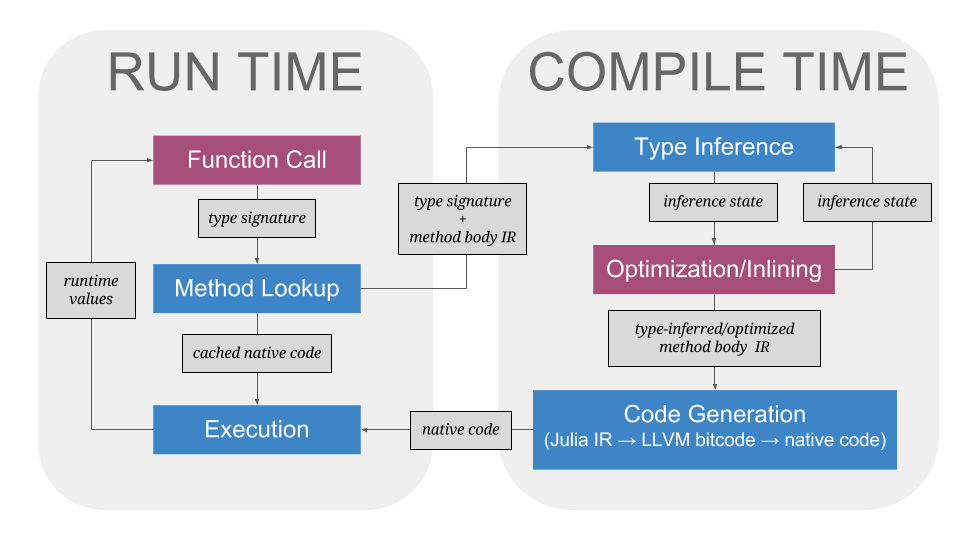

# What is Cassette?

Cassette is a Julia package that provides a just-in-time (JIT) pass injection mechanism,
referred to as an **overdubbing mechanism**, that interleaves external context-specific
code transformations with Julia's normal JIT-compilation cycle. Drawing inspiration from the
LLVM community's thriving ecosystem of transformation passes, we hope that Cassette's
overdubbing mechanism will jump-start an ecosystem of Julia compiler "plugins", modular
compiler optimizations/extensions that exist outside of the compiler itself.

On top of its overdubbing mechanism, Cassette implements two new features for the Julia
language: **contextual dispatch** and **contextual metadata propagation**. Using these
features, Julia developers can define new "contexts" that modify the execution of
Cassette-unaware Julia code to achieve a variety of goals.

For example, downstream applications of Cassette include automatic differentiation, interval
constraint programming, dynamic code analysis (e.g. profiling, `rr`-style debugging, etc.),
JIT transpilation to GPU backends, automatic parallelization/rescheduling, memoization,
high-level automated memory management and code fuzzing.

# How does Cassette work?

To understand how Cassette works, one must have at least a superficial understanding of
Julia's JIT compilation cycle. A diagram of this cycle is shown below. Note that it is
quite incomplete, but sufficient for the purposes of understanding Cassette [1].

[1] To be considered complete, this diagram would need to also have a "parse time" section,
which would include Julia AST construction and macro expansion.
